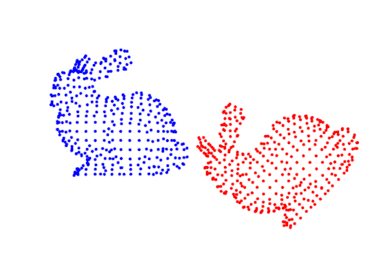
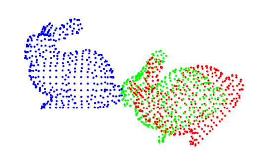
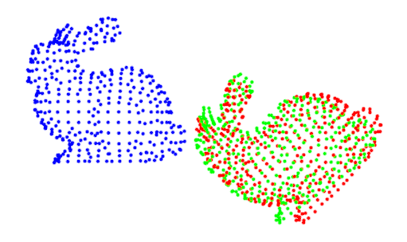

Hi there! You are probably interested in finding the correspondences between point clouds. Maybe you have data from two 
different LiDARs and you would like to find the rotation and translation between the device's base coordinate systems. 
Or maybe, you are just like me, interested in finding the transformation between data taken from different media.

Consider that you have two different point clouds, and iterative closest point algorithm aims to minimize the distance 
between these point clouds, this way it finds the relative correspondences between point clouds.

It is an iterative algorithm, because at the beginning, we don't know the correspondences between the point sets. In 
this case it is impossible to find the transformation between the point sets in one step. We need something iterative.
How?

Basically we will have some function which represents the difference between the two point sets, and we will try to 
minimize this function iteratively. This will lead to the rotation and translation which gives the minimum difference 
between the point sets. Let's explain it with an example, shall we?

### Basic Example of ICP Algorithm
Consider you have two point clouds. One property of these point clouds is that they are exactly the same, only one of them is
the rotated and translated version of the other one. This way it is easy to check the correctness of the result.

Below image shows the source and target clouds, blue and red respectively:




The red point cloud is 45 degrees rotated in the z-axis and 0.25 meters translated in x-axis version of the blue point cloud.

```c++
PointCloudT::Ptr transformed_cloud = std::make_unique<PointCloudT>();
// start with identity matrix as the transformation (4 X 4)
Eigen::Matrix4f transform = Eigen::Matrix4f::Identity();

// Define a rotation matrix (see https://en.wikipedia.org/wiki/Rotation_matrix)
// Below transformation matrix rotates the source around the z-axis by 45 degress
// and translates it in the x-axis by 0.25 meters. It is in the homogeneous format.
// cos(45)  -sin(45)   0   0.25
// -sin(45)  sin(45)   0    0
//    0           0    1    0
//    0           0    0    1 
float theta = M_PI/4; // The angle of rotation in radians
transform (0,0) = std::cos (theta);
transform (0,1) = -sin(theta);
transform (1,0) = sin (theta);
transform (1,1) = std::cos (theta);

// Define a translation of 0.25 meters on the x axis.
transform (0,3) = 0.25;
//The transformation is applied to the source cloud
pcl::transformPointCloud (source_cloud, *transformed_cloud, transform);
```

The task now is to match these two point clouds. If we knew the point correspondences, this problem would be solved in 
closed form solution. 

```text
Consider A represents our transformation matrix, 4x3. Not in the homogeneous format.
A = (R t)
We know point x from set 1, corresponds to point p from set 2. Below error function shows the 
average difference between set 1 and set 2 after the rotation R and translation t is applied.
```


```text
Here is the thing, if we know our matrix A is rank(3), we will be able to calculate rotation
and translation by finding the singular value decomposition of transformation matrix A.
```

However as I mentioned before, we don't know the correspondences between the sets, so we need to try different 
correspondences, which will at some point in time lead to minimum sum of squares error. This is why we need an iterative
approach.

#### Steps of ICP algorithm
1. Determine the point correspondences between the two sets.
2. Computer rotation and translation via SVD.
3. Apply this rotation and translation you found in the above step to the source cloud.
4. Compute E(R, t) between the new cloud calculated in the above step and the target cloud.
5. If the calculated error is larger than the threshold;
   * then repeat the steps above.
   * stop and output the alignment, otherwise.
    
Below you can see how I applied ICP algorithm. I have a parent class since I am planning to try different registration 
methods as well, at some point. For ICP algorithm, I simply used the function from PointCloudLibrary(PCL).
```text
icp_algorithm.h
```

```c++
#include <pcl/registration/icp.h>
#include "shape_registration.h"
using Matrix4 = Eigen::Matrix<float, 4, 4>;

class ICPAlgorithm : public ShapeRegistration {
 public:
  ICPAlgorithm(const PointCloudT & source, const PointCloudT &target) {
    this->m_source_cloud = source;
    this->m_target_cloud = target;
  }
  void set_point_clouds(const PointCloudT & source, const PointCloudT &target) override {
    this->m_source_cloud = source;
    this->m_target_cloud = target;
  };
  PointCloudT apply_registration() override;

 protected:
  pcl::IterativeClosestPoint<pcl::PointXYZ, pcl::PointXYZ> icp;
};
```

```text
icp_algorithm.cpp
only the the function which applies the registration
```

```c++
PointCloudT ICPAlgorithm::apply_registration() {
    // Set the input source and input target point clouds to the icp algorithm.
    icp.setInputSource(std::make_shared<PointCloudT>(this->m_source_cloud));
    icp.setInputTarget(std::make_shared<PointCloudT>(this->m_target_cloud));
    
    // Create a new point cloud which will represent the result point cloud after
    // iteratively applying transformations to the input source cloud, to make it
    // look like the target point cloud.
    PointCloudT final_cloud;
    this->icp.align(final_cloud);
    
    return final_cloud;
}
```

Let's see some results!

```c++
auto icp = std::make_unique<ICPAlgorithm>(source_cloud, target_cloud);
auto final_cloud = icp->apply_registration();
visualize_point_clouds(source_cloud, final_cloud, target_cloud);
```

We know that blue points show the source and red points show the target. Green set is the result of ICP registration 
algorithm. Achieving the below result, the defult maximum number of iteration is used which is 10 in PCL library.
The difference between resulted cloud(green) and the target cloud(red) is 0.000238633.



After increasing the maximum number of iterations parameter to 20, the below result can be achieved.



You can look at the ICP algorithm example in PCL from [here](https://pcl.readthedocs.io/projects/tutorials/en/latest/interactive_icp.html).


### Cons of PCL
So far PCL algorithm helped us to achieve the registration between two point sets after applying a rigid body transformation.
However there are some cons of ICP algorithm:

* Computationally expensive
* Converges to local minima.
* Doesn't work well with some specific transformations. Sadly not a good fit for non-homogeneous transformations.
* Sensitive to outliers and noise.


### References
* Besl, Paul J., and Neil D. McKay. "Method for registration of 3-D shapes." Sensor fusion IV: control paradigms and data structures. Vol. 1611. International Society for Optics and Photonics, 1992.
* [Awesome slides from University of Freiburg-Mobile Robotics Lecture 18](http://ais.informatik.uni-freiburg.de/teaching/ss13/robotics/slides/18-icp.pdf)


